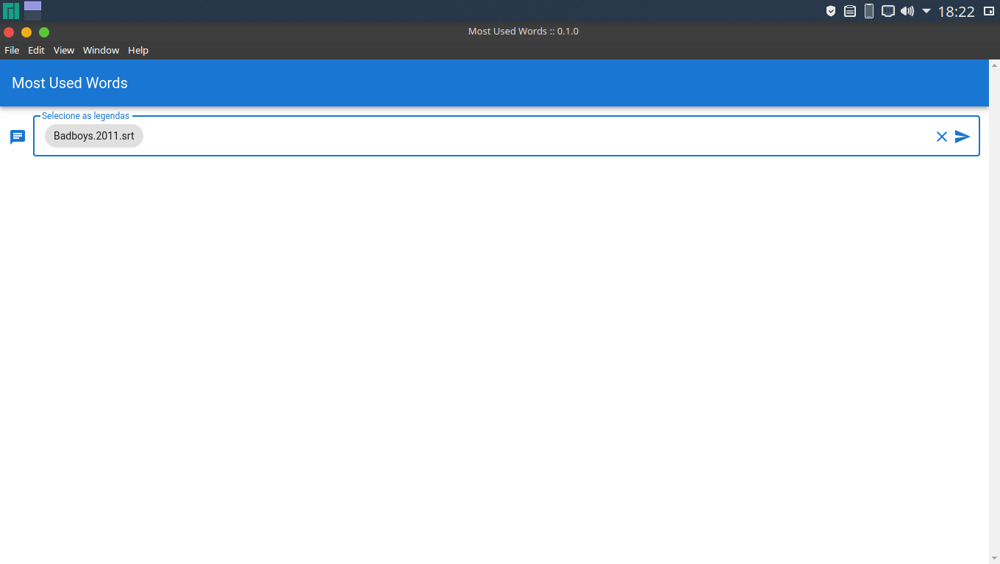
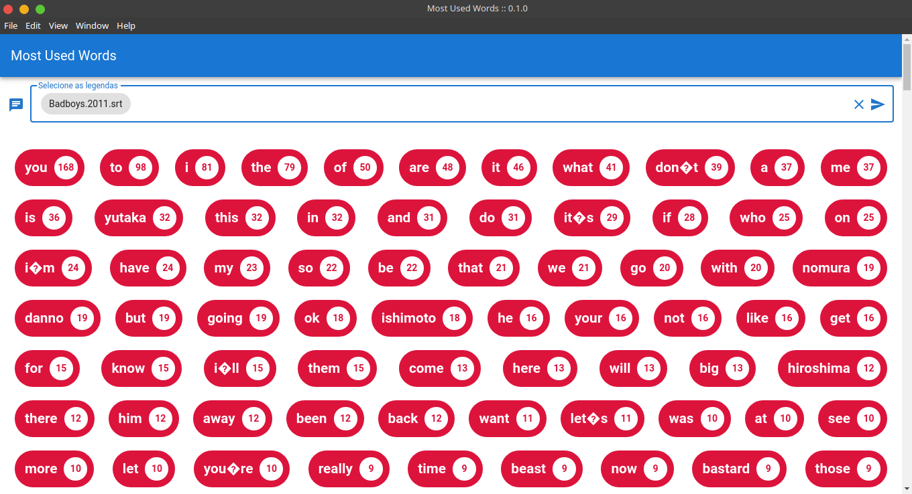

# Most Used Words

### O que é o Most Used Words?
  *Most Used Words* é uma aplicação feita com **Electron + VueJS** que faz a contagem das palavras
  mais faladas de um filme/séris através do arquivo de legenda srt.

### Funcionalidades
  O usuário pode fazer a seleção de múltiplas legendas através do campo "Selecione as Legendas" e
  o aplicativo retornará as palavras mais faladas com a quantidade de vezes em que foi citada.

### Layout
<h2>Interface principal</h2>

<h2>Resultados após o processamento do arquivo .srt</h2>

